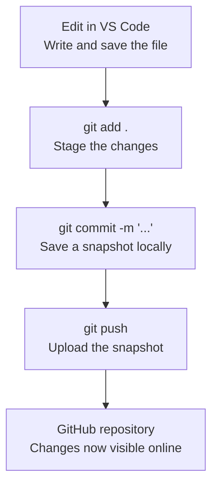

# Humanitarian AI Newsletter

```mermaid
flowchart TD
    A["Edit in VS Code<br/>Write and save the file"] --> B["git add .<br/>Stage the changes"]
    B --> C["git commit -m '...'<br/>Save a snapshot locally"]
    C --> D["git push<br/>Upload the snapshot"]
    D --> E["GitHub repository<br/>Changes now visible online"]
```
